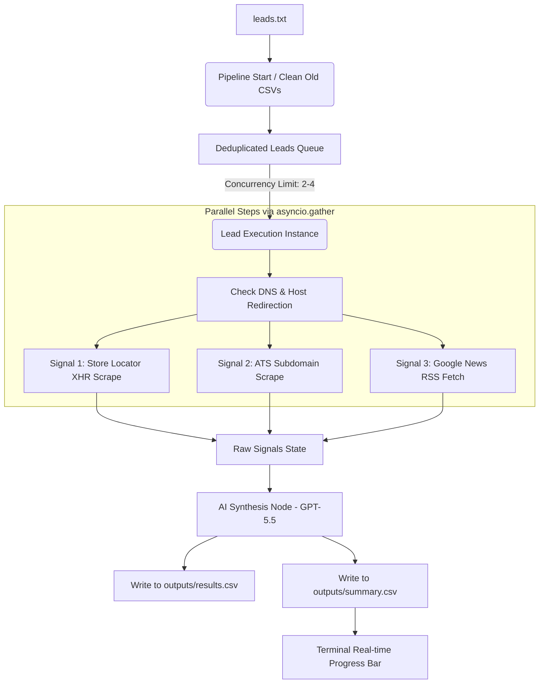

# TECHNICAL & OPERATIONAL DOCUMENTATION: QSR Lead Enrichment & Signal Extraction Engine

This document provides a comprehensive technical overview of the implementation status, architecture, and instructions for reading and interpreting the output results of the B2B QSR Signal Extraction Engine.

---

## 1. SIGNAL IMPLEMENTATION STATUS

Here is a breakdown of what was outlined in the requirements versus what is programmatically implemented in the codebase:

### 1.1 Signal: Geographic & Footprint Expansion
* **Concept:** Intercept store locator APIs to capture store counts and detect net-new location additions.
* **Implementation Status:** **Fully Implemented & Automated.**
  * **XHR Interception:** The engine launches Playwright in the background and listens to network responses (`page.on("response", ...)`). It identifies requests returning JSON payloads, GraphQL coordinates, or spatial files containing store counts or store details.
  * **Path Sweeping:** The engine automatically tests a sequenced list of high-probability paths (e.g., `/locations`, `/store-locator`, `/find-a-store`, `/restaurants`).
  * **DNS/Domain Redirection Auto-Resolution:** If a lead has an inferred domain (e.g., `McDonald's USA` -> `mcdonaldsusa.com`) that redirects to a different actual corporate domain (e.g., `www.mcdonalds.com`), the engine automatically resolves the target domain before initiating sweeps, eliminating connection failures.
  * **Stateful Delta Comparison:** Using the local SQLite cache (`outputs/cache/signals.db`), the engine records the `store_count_today` and arrays of `store_ids`. On subsequent runs, it compares the current count against the cached count. If there is a delta or a new ID is detected, `expansion_detected` is marked `TRUE`.

### 1.2 Signal: Frontline Churn & High-Velocity Hiring
* **Concept:** Scan careers subdomains to identify underlying Applicant Tracking Systems (ATS) and count open job requisitions.
* **Implementation Status:** **Fully Implemented & Automated.**
  * **Subdomain Enumeration & Redirect Tracking:** Pings candidate-facing career URLs (e.g., `/careers`, `/jobs`, `/about/careers`, `/join-us`) and follows redirects to identify whether they use specialized hospitality platforms (like *Harri*, *Snagajob*, *Paradox/Olivia*) or corporate legacy systems (like *Workday*).
  * **Job Volume Scraping:** Intercepts active job listings or counts them via HTML selectors and network traffic.
  * **AI-Assisted Job Classification:** The raw scraped titles are processed by Azure OpenAI `gpt-5.5` to group jobs into key business segments (e.g., *Shift Supervisor*, *Store Manager*, *Kitchen Staff*) and determine hiring strength.

### 1.3 Signal: Franchisee Consolidation & Corporate Moves
* **Concept:** Use Google Dorks via programmatic news feeds to find B2B events (mergers, acquisitions, franchise updates) while filtering out consumers/B2C review spam.
* **Implementation Status:** **Fully Implemented & Automated.**
  * **Google News RSS Parser:** Programmatically constructs strict Boolean search queries for each brand:
    `"Brand Name" (acquires OR "new locations" OR "new restaurant" OR expansion OR "opens new" OR franchise OR "multi-unit" OR merger) -yelp -tripadvisor -doordash -ubereats -grubhub -opentable`
  * **B2C Noise Filter:** The negative keywords (`-yelp`, `-tripadvisor`, etc.) are hardcoded into the query to keep the search strictly focused on corporate, financial, and franchising announcements.
  * **Contextual Extraction:** Downloads the RSS feed xml, extracts the top 10 articles, and sends the headlines, publications, and dates directly into the LangGraph state.

---

## 2. SYSTEM DATA FLOW ARCHITECTURE

The pipeline uses **LangGraph** to manage state and route execution, and is run completely in parallel via **asyncio concurrent tasks**.



1. **Initialization:** The script deletes files from previous runs to avoid duplicating data. It reads `leads.txt` and deduplicates names.
2. **DNS/HTTP Pre-flight Check:** For each lead, it checks if the domain resolves. If it resolves to a redirected domain, it updates the host target (e.g., `starbucks.com` -> `www.starbucks.com`). If unreachable, it flags it immediately, skipping browser execution to save time.
3. **Concurrent Scraping:** Launches parallel requests for the three signals.
4. **AI Synthesis (Azure OpenAI gpt-5.5):** Synthesizes the raw data, calculates an LLM confidence score, and generates outreach sentences.
5. **Double Output Generation:** Appends the full dataset to `results.csv` and the simplified dashboard to `summary.csv`.

---

## 3. HOW TO READ AND INTERPRET THE OUTPUTS

The program generates two files under the `outputs/` directory:

### 3.1 `outputs/results.csv` (The Full Database)
This contains **25 columns** recording every detail of the scrape. Use this for deep audits, data logs, or troubleshooting why a signal failed.

* **`expansion_summary`**: Description of store location counts and news headlines found.
* **`critical_roles`**: Specific key management roles identified as currently hiring.
* **`outreach_context`**: Complete, multi-sentence SDR pitch generated by GPT-5.5.
* **`cache_hits`**: Lists which signals used cached data, minimizing API costs and execution time.

---

### 3.2 `outputs/summary.csv` (The Clean SDR Dashboard)
This contains **7 columns** and is designed to be easily read, sorted, or filtered in Excel/Google Sheets.

| Column Name | Data Type | Description |
| :--- | :--- | :--- |
| **`company_name`** | String | The official name of the company. |
| **`company_domain`** | String | The verified web domain of the company. |
| **`primary_signal`** | String (Enum) | **The 1-word core classification tag** (see below). |
| **`open_roles`** | Integer | Number of open job posts found. |
| **`store_delta`** | Integer | Number of net-new locations detected since the last run. |
| **`confidence`** | Float (0.00 - 1.00) | Confidence level of the AI synthesis. |
| **`one_line_summary`** | String | **The single-sentence hook** to use for prospecting. |

#### Interpretation of `primary_signal` Values:
* **`CONSOLIDATION`**: *High Priority.* Surfaced when news feeds indicate mergers, acquisitions, or multi-unit franchisee buyouts (e.g., a franchise group buying 40+ Taco Bell locations). This is a prime trigger to sell HR/Compliance unification tools.
* **`EXPANSION`**: *High Priority.* Triggered when a physical store delta is recorded (e.g., new store IDs detected) or when news articles explicitly mention new branch openings. Best trigger for localized mass hiring tools.
* **`HIRING`**: *Medium Priority.* Triggered when the careers platform is active with medium/high volumes of job vacancies (e.g., 50+ open roles), indicating organizational growth.
* **`ACTIVE`**: *Low Priority.* The company has a small number of open positions or news activity, but no major expansion triggers.
* **`UNREACHABLE`**: *Review Needed.* The target website was unreachable (e.g., due to strong bot protection). The news signal is still captured and should be reviewed.
* **`STABLE`**: *No immediate action.* Company websites were successfully checked but showed normal operation, no store count additions, and low hiring volumes.

---

## 4. COMMAND LINE USAGE

Ensure you are inside the virtual environment:
```bash
# 1. Activate the environment
source .venv/bin/activate

# 2. Run the pipeline (Default uses leads.txt and concurrency from .env)
python main.py

# Optional: Run with custom leads list and custom concurrency
python main.py --leads custom_leads.txt --concurrency 4
```

* Detailed logs are written to: `outputs/pipeline.log`
* Target outputs are written to: `outputs/results.csv` and `outputs/summary.csv`
* Cache databases are kept in: `outputs/cache/signals.db`
